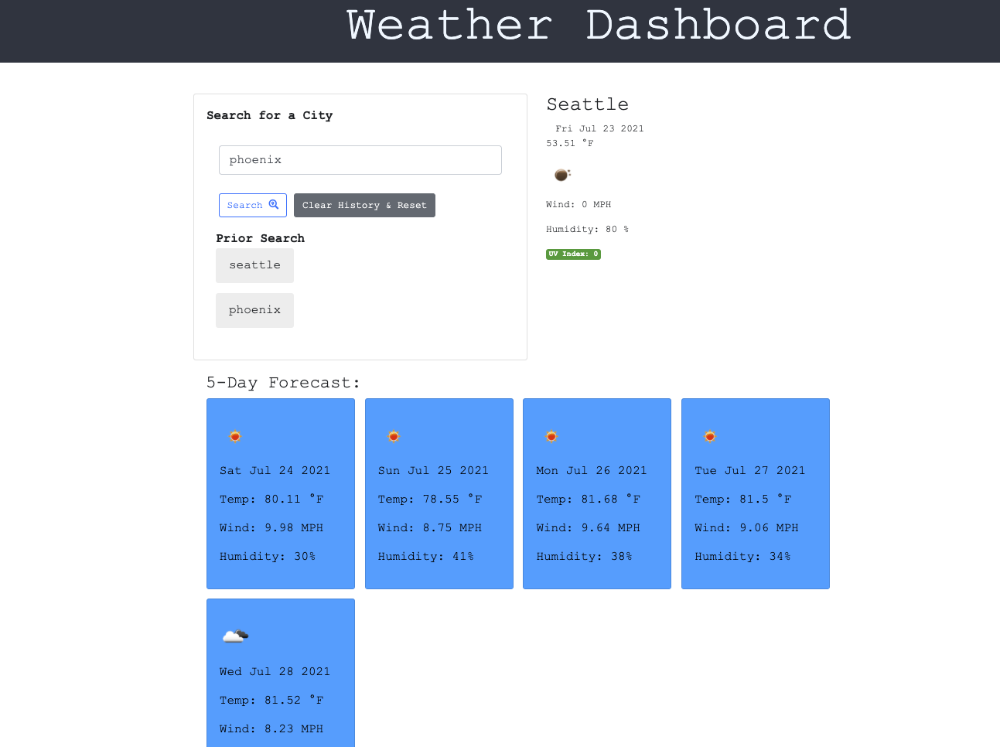

# weather-dashboard

### Deployed link: [Weather-Dashboard](https://wsamuell.github.io/weather-dashboard/)

### Github Repo: [Wsamuell](https://github.com/Wsamuell/weather-dashboard)

* Weather Dashboard with custom styling built to be  display 7 day weather forcast based on city location entired

### Built With
* [Open Weather Api](https://openweathermap.org/)
* CSS for Styling
* Javascript for functionality

### User Story
* AS A traveler
* I WANT to see the weather outlook for multiple cities
* SO THAT I can plan a trip accordingly

### Screenshot

